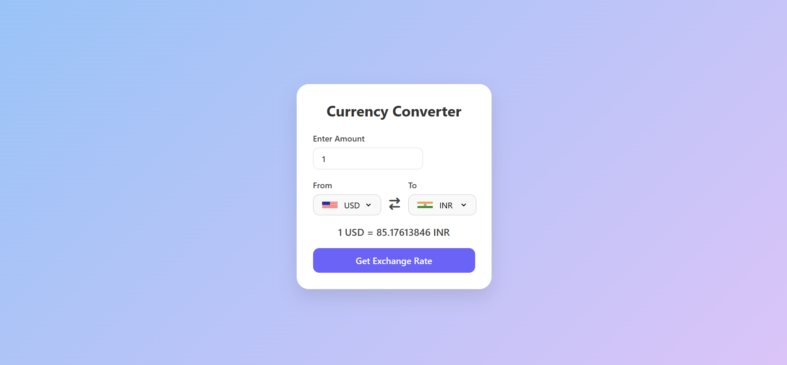

# 💱 Currency Converter Web App

A responsive and user-friendly **Currency Converter** built using **HTML**, **CSS**, and **JavaScript**. It fetches real-time exchange rates from an open API and dynamically updates conversion values. Clean UI and responsive design make it perfect for all screen sizes.

---

## 📌 Features

- 🔄 Real-time exchange rate conversion
- 🌍 Country flags update with selected currencies
- 💻 Responsive and modern UI
- 🔁 Swap between any two currencies
- ✅ Pre-selected popular pairs (USD to INR by default)

---

## 🧰 Tech Stack

- ✅ HTML5
- ✅ CSS3 (Modern UI with Flexbox)
- ✅ JavaScript (Fetch API, DOM Manipulation)
- ✅ [Flags API](https://flagsapi.com/)
- ✅ [Currency API by @fawazahmed0](https://github.com/fawazahmed0/exchange-api)

---

## 🔗 Live Demo

[🚀 Live Preview](https://biswajit-pal1.github.io/Currency-Converter/)  
_Replace the link above with your GitHub Pages URL_

---

## 📸 Screenshot

